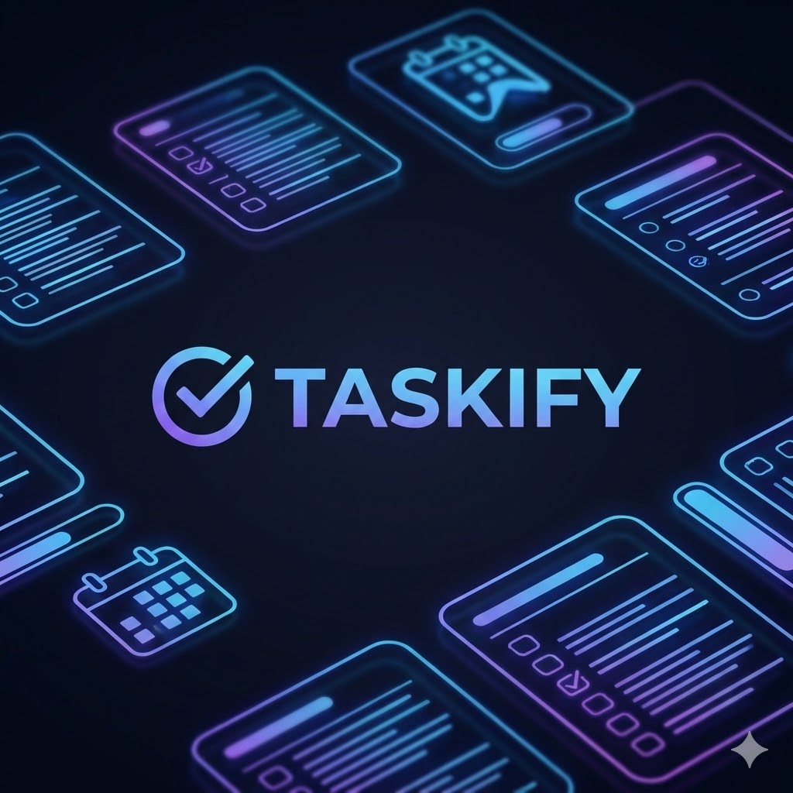

<p align="center">
  
</p>

<h1 align="center">Taskify</h1>

<p align="center">
  <strong>Team-based task management REST API with Telegram notifications and Google OAuth</strong>
</p>

<p align="center">
  <a href="#quick-start">Quick Start</a> &middot;
  <a href="#architecture">Architecture</a> &middot;
  <a href="#api-reference">API Reference</a> &middot;
  <a href="#configuration">Configuration</a> &middot;
  <a href="#deployment">Deployment</a>
</p>

<p align="center">
  
  
  
  
  
  
</p>

---

## Overview

Taskify is a RESTful API for team task management. Users create teams, invite members, assign tasks, leave comments, and receive notifications through a connected Telegram bot. Authentication supports email/password and Google OAuth, secured with JWT.

---

## Quick Start

```bash
git clone https://github.com/your-username/taskify.git
cd taskify

# Configure credentials
cp Taskify/appsettings.Example.json Taskify/appsettings.Development.json

# Run (FluentMigrator applies migrations automatically on startup)
dotnet run --project Taskify
```

Requires [.NET 9 SDK](https://dotnet.microsoft.com/download/dotnet/9.0) and [PostgreSQL 14+](https://www.postgresql.org/download/). Swagger UI is available at `/swagger`.

---

## Architecture

```
Taskify/              API — controllers, middleware, DI configuration
BusinessLogic/        Services, interfaces, DTOs
DataAccess/           EF Core DbContext, models, repositories, FluentMigrator migrations
```

```
Taskify (API)  --->  BusinessLogic  --->  DataAccess
```

Controllers extract the user ID from JWT claims and delegate to service interfaces. Services enforce business rules and authorization. Data access is abstracted through repositories over EF Core.

---

## API Reference

> All endpoints except auth and the Telegram webhook require `Authorization: Bearer <token>`.

### Auth

| Method | Endpoint | Description |
|--------|----------|-------------|
| `POST` | `/api/auth/register` | Create a new account |
| `POST` | `/api/auth/login` | Login, returns JWT |
| `POST` | `/api/auth/google-auth` | Google OAuth login |
| `GET` | `/api/auth/me` | Current user profile |

### Tasks

| Method | Endpoint | Description |
|--------|----------|-------------|
| `POST` | `/api/tasks` | Create a task |
| `PATCH` | `/api/tasks` | Update a task |
| `DELETE` | `/api/tasks/delete/{taskId}` | Delete a task |
| `GET` | `/api/tasks/my` | My assigned tasks |
| `GET` | `/api/tasks/team/{teamId}` | Tasks by team |
| `POST` | `/api/tasks/comment` | Add a comment |
| `GET` | `/api/tasks/comment/{taskId}` | Get comments for a task |

### Teams

| Method | Endpoint | Description |
|--------|----------|-------------|
| `POST` | `/api/team` | Create a team |
| `GET` | `/api/team` | My teams |
| `GET` | `/api/team/{teamId}/members` | Team members |

### Invitations

| Method | Endpoint | Description |
|--------|----------|-------------|
| `POST` | `/api/invitations/send` | Send invitation |
| `GET` | `/api/invitations` | My pending invitations |
| `POST` | `/api/invitations/{id}/accept` | Accept |
| `POST` | `/api/invitations/{id}/reject` | Reject |

### Telegram

| Method | Endpoint | Description |
|--------|----------|-------------|
| `POST` | `/api/telegram` | Generate bot connection link |
| `GET` | `/api/telegram/status` | Connection status |
| `DELETE` | `/api/telegram/disconnect` | Disconnect bot |
| `POST` | `/api/telegram/webhook` | Bot webhook |

---

## Configuration

```jsonc
{
  "ConnectionStrings": {
    "DefaultConnection": "Host=localhost;Port=5432;Database=TaskifyDatabase;Username=your_user;Password=your_password"
  },
  "JwtSettings": {
    "SecretKey": "your-secret-key-at-least-32-characters-long",
    "Issuer": "TaskifyServer",
    "Audience": "TaskifyClient",
    "ExpiresInMinutes": 60
  },
  "Google": {
    "ClientId": "your-google-client-id.apps.googleusercontent.com",
    "ClientSecret": "your-google-client-secret"
  },
  "Telegram": {
    "TokenKey": "your-telegram-bot-token",
    "BotUsername": "YourBotUsername"
  }
}
```

Production secrets are stored in `appsettings.Production.json` outside the repository.

---

## Deployment

The project runs on a **Raspberry Pi** with CI/CD through a GitHub Actions self-hosted runner. Every push to `main` triggers the pipeline:

```
Push to main  ->  Restore  ->  Test  ->  Publish  ->  Restart systemd service
```

The published build is deployed to `~/backend/`, and the API runs as a `systemd` unit (`taskify.service`) with automatic restarts and logging via `journalctl`.

---

## Testing

```bash
dotnet test
```

Unit tests are written with xUnit and FluentAssertions.

---

## Tech Stack

| Component | Technology |
|-----------|-----------|
| Runtime | .NET 9 |
| ORM | Entity Framework Core 9 |
| Migrations | FluentMigrator |
| Database | PostgreSQL |
| Auth | JWT Bearer + Google OAuth |
| Notifications | Telegram Bot API |
| Testing | xUnit + FluentAssertions |
| CI/CD | GitHub Actions (self-hosted) |
| Hosting | Raspberry Pi + systemd |

---

## License

This project is licensed under the - if you want use it, just tag me and use it :)
